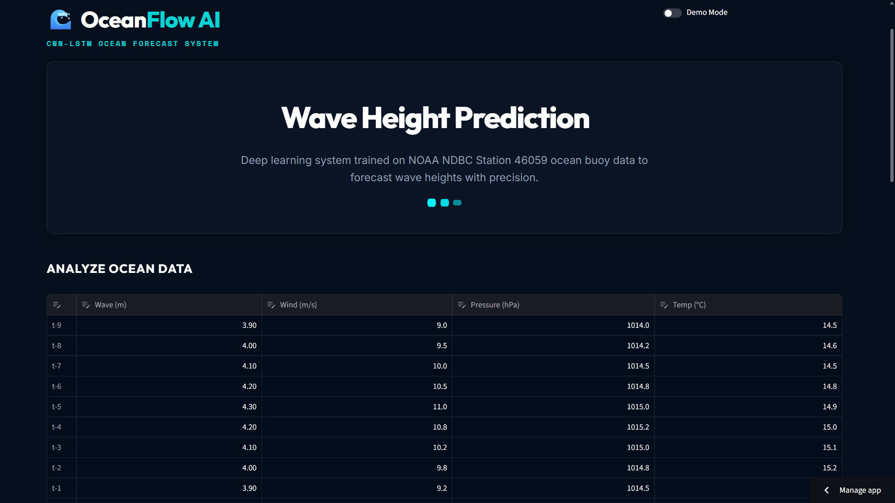
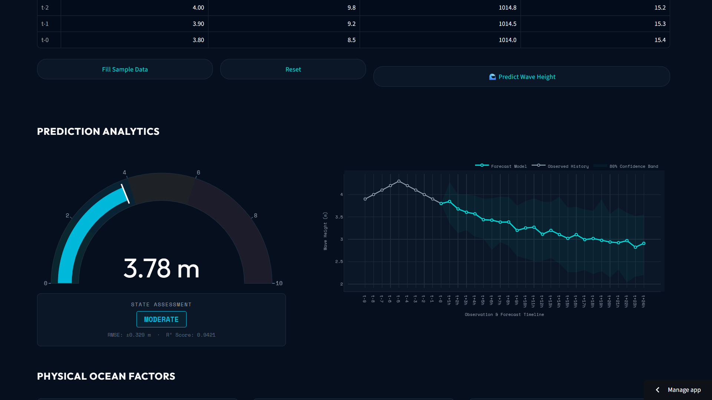

# <p align="center">🌊 OceanSense — CNN-LSTM Wave Height Forecasting</p>

<p align="center">
  <strong>A deep learning system trained on real NOAA buoy telemetry to forecast ocean wave height, with honest, verified accuracy at multiple forecast horizons.</strong>
</p>

<p align="center">
  🚀 <strong>Live Demo:</strong> <a href="https://waveproject-77ta4ugfask9bl5yqe6da4.streamlit.app/">https://waveproject-77ta4ugfask9bl5yqe6da4.streamlit.app/</a>
</p>

<p align="center">
  <a href="https://waveproject-77ta4ugfask9bl5yqe6da4.streamlit.app/"></a>
  
  
  
  
</p>

---

## 📸 Dashboard Preview

<p align="center">
  
</p>
<p align="center">
  
</p>

<p align="center">
  <em>
    <strong>Top:</strong> Live ocean data table (10-hour lookback window) feeding the model. <br/>
    <strong>Bottom:</strong> 1-hour prediction gauge with sea-state assessment, alongside a 24-hour Monte Carlo forecast with an 80% confidence band.
  </em>
</p>

---

## ✨ Key Features

* 🧠 **CNN-LSTM architecture** — `Conv1D → MaxPooling1D → LSTM(50) → Dense(1)`, trained end-to-end on real ocean telemetry.
* 📡 **Real NOAA NDBC buoy data** — one year (2023) of observations from **Station 46059**, resampled from native 10-minute readings to hourly means.
* 🎯 **Evaluated against a real baseline, not just accuracy alone** — every prediction is benchmarked against a naive persistence forecast at 5 horizons (1h, 3h, 6h, 12h, 24h), reported honestly including where the model does *not* win.
* 🌊 **Dual forecast view** — a 1-hour-ahead gauge with a Calm/Moderate/Rough state badge, plus a 24-hour multi-step Monte Carlo rollout with an 80% uncertainty band.
* 📊 **Interactive Plotly timeline** — visualizes the 10-hour observed history transitioning into the 24-hour forecast in one continuous chart.
* 🎨 **Custom dark ocean-themed UI** — glassmorphic cards, animated gauge, dark navy dashboard styling.

---

## 🔬 Model & Results

| Component | Details |
| :--- | :--- |
| **Architecture** | CNN-LSTM (Conv1D → MaxPooling1D → LSTM → Dense), 23,627 parameters |
| **Training data** | NOAA NDBC Station 46059, full year 2023, resampled to hourly |
| **Features** | Wave height, wind speed, atmospheric pressure, sea surface temperature |
| **Lookback window** | 10 hours (t-9 → t-0) |
| **Forecast horizons evaluated** | 1h, 3h, 6h, 12h, 24h |

**Skill score vs. persistence baseline** (positive = model beats naive "no change" forecast):

| Horizon | Model RMSE | Persistence RMSE | Skill Score |
| :--- | :--- | :--- | :--- |
| 1 hour | 0.328 m | 0.296 m | **-0.108** |
| 3 hours | 0.374 m | 0.392 m | +0.046 |
| 6 hours | 0.538 m | 0.567 m | +0.052 |
| 12 hours | 0.782 m | 0.832 m | **+0.060** |
| 24 hours | 1.128 m | 1.153 m | +0.021 |

At a 1-hour horizon, wave height is highly autocorrelated, so a naive "assume no change" forecast is genuinely hard to beat — and this model doesn't beat it. From 3 hours onward, as persistence accuracy degrades, the model shows a consistent, modest improvement, peaking around 12 hours. This project reports that trade-off directly rather than only showcasing the horizons where the model wins.

---

## 📡 Input Features

1. 🌊 **Wave Height (m)** — the primary time series being forecast.
2. 💨 **Wind Speed (m/s)** — the main physical driver of wave energy transfer.
3. 🎈 **Air Pressure (hPa)** — pressure drops signal incoming storm systems.
4. 🌡️ **Sea Surface Temperature (°C)** — secondary indicator of ocean thermal state.

---

## ⚙️ How It Works

1. **Data input** — load a 10-hour sequence via the dashboard's editable table, or click **Fill Sample Data**.
2. **Preprocessing** — the sequence is scaled using a `MinMaxScaler` fit only on the original training set (never refit on new input, to avoid leakage).
3. **1-hour inference** — the CNN-LSTM produces a direct next-hour wave height prediction, shown on the gauge with a sea-state badge.
4. **24-hour forecast** — a recursive Monte Carlo rollout (50 simulated trajectories) projects wave height forward 24 hours, propagating uncertainty into a shaded confidence band.

---

## 📂 Project Structure

```text
wave_project/
├── app.py                     # Streamlit dashboard (UI + inference)
├── wave_prediction.py         # Model training pipeline
├── step2_dataset.py           # Data loading, cleaning, hourly resampling
├── step3_preprocessing.py     # Sequence windowing
├── evaluate_horizons.py       # Multi-horizon skill score evaluation
├── download_data.py           # NOAA buoy data fetch script
├── requirements.txt
├── assets/
│   ├── dashboard_hero.png
│   └── prediction_analytics.png
├── models/
│   ├── wave_model.keras
│   ├── scaler.pkl
│   ├── metrics.pkl
│   ├── horizon_comparison.csv
│   ├── learning_curve.png
│   └── prediction_plot.png
└── LICENSE
```

---

## 🛠️ Getting Started

### 1. Prerequisites
- Python 3.9+
- Git

### 2. Installation
```bash
git clone https://github.com/lekshmiparu23-ai/wave_project.git
cd wave_project
python -m venv .venv
.venv\Scripts\activate        # Windows
pip install -r requirements.txt
```

### 3. Run locally
```bash
python download_data.py       # fetch buoy data
python wave_prediction.py     # train model, generate metrics
streamlit run app.py          # launch the dashboard
```
Open `http://localhost:8501` in your browser.

---

## 💻 Tech Stack

<p align="left">
  
  
  
  
  
  
  
</p>

---

## ⚠️ Known Limitations

- Trained on a single buoy, single year — not yet validated across other locations or storm-heavy periods.
- The 24-hour rollout holds wind, pressure, and SST constant rather than forecasting them, which likely understates true long-horizon uncertainty.
- Underperforms persistence at the 1-hour horizon — disclosed above rather than omitted, since it reflects a real property of the signal, not a defect.

---

## 👨‍💻 Author

**Lekshmi Maniyan**
* **GitHub**: [@lekshmiparu23-ai](https://github.com/lekshmiparu23-ai)
* **Email**: lekshmiparu23@gmail.com

---

## 📄 License

This project is licensed under the **MIT License** — see [LICENSE](LICENSE) for details.